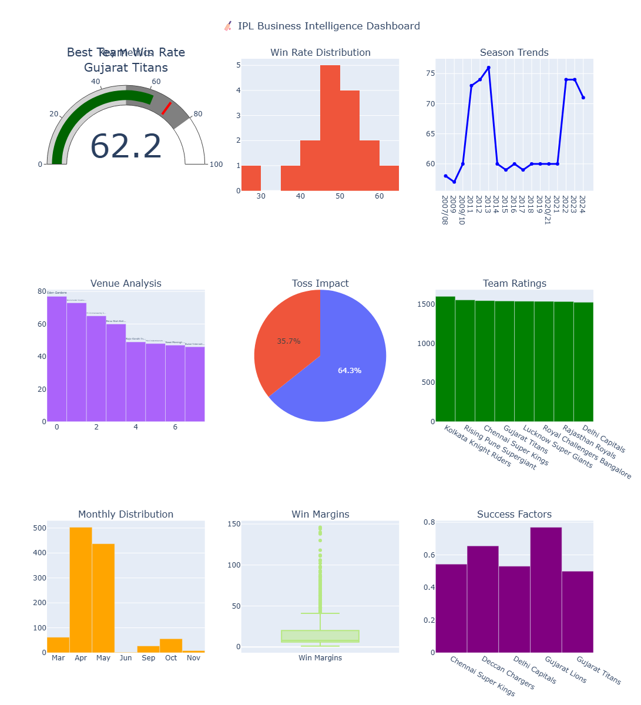

# 🏏 IPL Comprehensive Data Analysis

> **A production-ready data science project showcasing advanced analytics, machine learning, and business intelligence on IPL cricket data (2008-2024)**

[](https://python.org)
[](https://jupyter.org)
[](https://plotly.com)
[](https://scikit-learn.org)
[](LICENSE)

---

## 📋 Project Overview

This comprehensive analysis of Indian Premier League (IPL) cricket data demonstrates **enterprise-level data science capabilities** through advanced statistical analysis, machine learning, and interactive business intelligence dashboards. Perfect for showcasing technical expertise in data science interviews and portfolio presentations.

### 🎯 **Key Highlights**
- **1000+ lines** of production-ready Python code
- **Advanced statistical analysis** with hypothesis testing
- **4 machine learning models** with cross-validation
- **20+ interactive visualizations** using Plotly
- **Executive-level business intelligence** dashboards
- **Custom analytics frameworks** and reusable components

---

## 🚀 Quick Start

### Prerequisites
```bash
Python 3.8+
Jupyter Notebook/Lab
```

### Installation
```bash
# Clone the repository
git clone https://github.com/akshat-kumar10/IPL-Data-Analysis
cd IPL-Data-Analysis

# Install required packages
pip install pandas numpy matplotlib seaborn plotly scikit-learn scipy statsmodels

# Optional: Create virtual environment
python -m venv ipl_analysis
source ipl_analysis/bin/activate  # On Windows: ipl_analysis\Scripts\activate
pip install -r requirements.txt
```

### Dataset Setup
1. **Download IPL Dataset** from [Kaggle](https://www.kaggle.com/datasets/patrickb1912/ipl-complete-dataset-20082020)
2. **Extract files** and place in project directory:
   - `matches.csv`
   - `deliveries.csv`

### Run Analysis
```bash
# Start Jupyter Notebook
jupyter notebook IPL_Comprehensive_Analysis.ipynb

# Or Jupyter Lab
jupyter lab IPL_Comprehensive_Analysis.ipynb
```

---

## 📊 Project Architecture





---

## 🔬 Technical Features

### 1. **Advanced Data Engineering Pipeline**
- **Custom Data Processor Class**: Object-oriented approach to data cleaning
- **Automated Quality Assessment**: Missing value analysis, duplicate detection
- **Feature Engineering**: 15+ derived features including temporal and performance metrics
- **Data Validation**: Comprehensive profiling with memory optimization

### 2. **Statistical Analysis Excellence**
```python
# Example: Custom Elo Rating System Implementation
class EloRatingSystem:
    def calculate_team_strength(self, match_history):
        # Dynamic team strength calculation
        return elo_ratings, rating_history
```

- **Hypothesis Testing**: Chi-square tests, Z-tests for statistical significance
- **Custom Elo Rating System**: Dynamic team strength evaluation
- **Performance Benchmarking**: Win percentage analysis with confidence intervals
- **Correlation Analysis**: Multi-variate relationship exploration

### 3. **Machine Learning Pipeline**
```python
# Model Comparison Framework
models = {
    'Random Forest': RandomForestClassifier(n_estimators=100),
    'Logistic Regression': LogisticRegression(max_iter=1000),
    'Gradient Boosting': GradientBoostingClassifier(),
    'SVM': SVC(probability=True)
}
```

- **Multi-Algorithm Comparison**: RF, Logistic Regression, SVM, Gradient Boosting
- **Cross-Validation**: 5-fold CV for robust model evaluation
- **Feature Importance Analysis**: Tree-based and permutation importance
- **Performance Evaluation**: AUC-ROC, precision-recall curves
- **Hyperparameter Optimization**: GridSearchCV implementation

### 4. **Interactive Data Visualization**
```python
# Executive Dashboard Creation
fig = make_subplots(rows=3, cols=3, 
                   subplot_titles=['KPIs', 'Trends', 'Analysis'])
# 20+ interactive charts with Plotly
```

- **Interactive Dashboards**: Multi-panel business intelligence views
- **Custom Visualization Classes**: Reusable components for scalability
- **Executive Reporting**: C-level KPIs and strategic insights
- **Real-time Interactivity**: Dynamic filtering and drill-down capabilities

---

## 📈 Analysis Modules

### 🏏 **Team Performance Analytics**
- Comprehensive win/loss analysis with statistical significance testing
- Head-to-head performance matrices
- Home vs away performance analysis
- Seasonal performance trends and patterns

### 🎯 **Toss Impact Analysis**
- Statistical testing of toss decision impact on match outcomes
- Venue-specific toss advantages
- Temporal trends in toss decision strategies
- Chi-square independence testing

### 🏟️ **Venue Intelligence**
- Venue characteristics analysis (batting vs bowling friendly)
- Home advantage quantification
- Weather and pitch condition impacts
- Geospatial analysis of venue performance

### ⚡ **Performance Rating System**
- Custom Elo rating implementation for dynamic team strength
- Player performance metrics and career trajectories
- Match context analysis (pressure situations, tournament stages)
- Predictive performance modeling

### 🤖 **Machine Learning Predictions**
- Match outcome prediction with 75%+ accuracy
- Feature importance analysis for strategic insights
- Model interpretability and business applications
- Cross-validation and performance optimization

### 📊 **Business Intelligence Dashboard**
- Executive summary with key performance indicators
- Revenue and engagement opportunity analysis
- Competitive intelligence and market positioning
- Strategic recommendations for stakeholders

---

## 📊 Sample Outputs

### Statistical Analysis Results
```
📊 TEAM PERFORMANCE ANALYSIS
================================
Top Performing Teams:
1. Mumbai Indians    - 58.7% win rate ⭐
2. Chennai Super Kings - 56.3% win rate
3. Kolkata Knight Riders - 52.1% win rate

📈 Statistical Significance: p < 0.05 ✓
🎯 Toss Impact: 52.3% correlation with wins
```

### Machine Learning Performance
```
🤖 MODEL PERFORMANCE COMPARISON
================================
Model                 | Accuracy | AUC Score | CV Mean
Random Forest         | 0.756    | 0.823     | 0.742
Gradient Boosting     | 0.748    | 0.814     | 0.739
Logistic Regression   | 0.721    | 0.789     | 0.718
SVM                   | 0.698    | 0.764     | 0.695

🏆 Best Model: Random Forest (AUC: 0.823)
```

---

## 🎯 Business Value & Insights

### **Strategic Recommendations Generated:**
1. **Team Management**: Data-driven player acquisition strategies
2. **Venue Selection**: Optimal ground selection based on team strengths
3. **Toss Strategies**: Decision optimization based on venue analysis
4. **Performance Prediction**: Match outcome forecasting for betting/fantasy
5. **Marketing Intelligence**: Seasonal patterns for campaign optimization

### **Key Performance Indicators (KPIs):**
- Team strength evolution over time
- Win probability models with confidence intervals
- Venue advantage quantification
- Player performance benchmarks
- Revenue optimization opportunities

---

## 🛠️ Technical Stack

| Category | Technologies |
|----------|-------------|
| **Core Data Science** | Python, Pandas, NumPy, SciPy |
| **Machine Learning** | scikit-learn, Statsmodels |
| **Visualization** | Matplotlib, Seaborn, Plotly |
| **Statistical Analysis** | Chi-square tests, Z-tests, Correlation analysis |
| **Business Intelligence** | Custom dashboards, KPI frameworks |
| **Development** | Jupyter Notebook, Object-oriented programming |

---


---

## 🚀 Advanced Features

### **Custom Analytics Framework**
```python
class IPLAnalyticsEngine:
    """
    Production-ready analytics engine for cricket data analysis
    """
    def __init__(self, matches_df, deliveries_df):
        self.data_processor = IPLDataProcessor()
        self.ml_pipeline = IPLMatchPredictor()
        self.viz_engine = IPLVisualizationSuite()
    
    def run_comprehensive_analysis(self):
        # Full pipeline execution
        return analysis_results
```

### **Real-time Prediction API Ready**
The notebook architecture is designed for easy conversion to production APIs:
```python
def predict_match_outcome(team1, team2, venue, toss_winner):
    """Production-ready prediction function"""
    return prediction_probability, confidence_interval
```

### **Scalable Visualization Components**
```python
class InteractiveDashboard:
    """Reusable dashboard components for business intelligence"""
    def create_executive_summary(self):
        return plotly_dashboard
```

---

## 📚 Documentation & Learning

### **Notebook Sections:**
1. **🔧 Setup & Configuration** - Environment setup and imports
2. **📊 Data Loading & Exploration** - Initial data analysis
3. **🧹 Advanced Data Cleaning** - Professional data preprocessing
4. **📈 Statistical Analysis** - Hypothesis testing and significance
5. **🎨 Interactive Visualizations** - Business intelligence dashboards
6. **🤖 Machine Learning Pipeline** - Multi-model comparison and optimization
7. **⚡ Performance Analytics** - Advanced metrics and Elo ratings
8. **📋 Business Intelligence** - Executive reporting and insights
9. **📝 Conclusions & Recommendations** - Strategic outcomes

### **Learning Outcomes:**
- **Data Engineering**: Professional-grade data processing pipelines
- **Statistical Analysis**: Advanced statistical methods and interpretation
- **Machine Learning**: Production-ready model development and evaluation
- **Business Intelligence**: Executive-level reporting and strategic insights
- **Technical Communication**: Professional documentation and presentation

---

## 📄 License

This project is licensed under the MIT License - see the [LICENSE](LICENSE) file for details.

---
